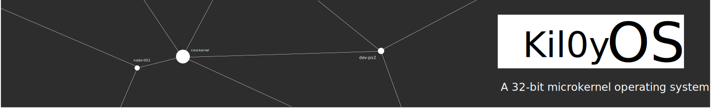

<div align="center">
  
  <h1>kil0yOS</h1>
  <p><strong>A 32-bit microkernel operating system</strong></p>
</div>

## Features

- Memory management with heap allocation
- VGA text mode display
- PS/2 keyboard input handling
- Interrupt handling with PIC and ISRs
- GDT and IDT setup
- FAT32-like filesystem with directories and files
- Persistent filesystem with ACPI shutdown support
- Command-line shell with built-in commands
- File read/write/edit operations
- Round-robin task scheduler

## Prerequisites

- gcc (32-bit cross-compilation support)
- nasm
- ld (GNU linker)
- grub-mkrescue
- qemu-system-x86_64

## Build

```bash
make
```

## Run

```bash
make run
```

## Commands

- ls - List directory contents
- cd - Change directory
- pwd - Print working directory
- mkdir - Create directory (supports path like `mkdir subdir/file`)
- rm - Remove file or directory
- touch - Create empty file
- cat - Display file contents
- edit - Edit file contents
- clear - Clear screen
- echo - Print text (supports redirect to file with >)
- whoami - Print current user
- version - Show OS version
- help - Show help information
- shutdown - Shut down the system (ACPI S5)
- net - Network management (wire, chknic, status)
- ping - Send ICMP echo requests

## Project Structure

```
src/
  boot/               - Bootloader (Assembly)
  kernel/
    core/             - Kernel core (main.c, gdt.c, idt.c, isr.c, interrupts.c)
    drivers/          - Device drivers
      disk.c          - ATA disk driver
      keyboard.c      - PS/2 keyboard driver
      pit.c           - Programmable Interval Timer
      power.c         - ACPI power management
      vga.c           - VGA display driver
    fs/               - Filesystem
      fs.c            - FAT32-like filesystem
      edit.c          - Text editor
    lib/              - Standard library (string.c, stdlib.c)
    mm/               - Memory management (memory.c)
    sched/            - Task scheduler
    shell/            - Command-line shell
    timer/            - Timer management

include/              - Header files
Makefile              - Build configuration
linker.ld             - Linker script
grub.cfg              - GRUB configuration
```

## License

GPL2.0
